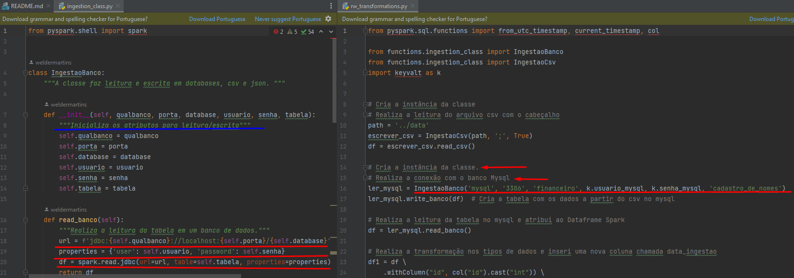

## Neste pequeno exemplo, será demonstrado como criar métodos de leitura e escrita em Classe Python:
 * Será feito a leitura de um arquivo csv para o Bano Mysql;
 * E do Mysql para o Banco Postgres com algumas transformações nos dados.

Esse tipo de organização poderá ajudar novos engenheiros a se adequar a política de padronização de códigos e evitará redundâncias. 

Obs: Como o intuito será demonstrar métodos em classe para ingestão, não será abordado como organizar os dados em camadas, meio de extrema importância para a qualidade dos dados ao usuário final.

   